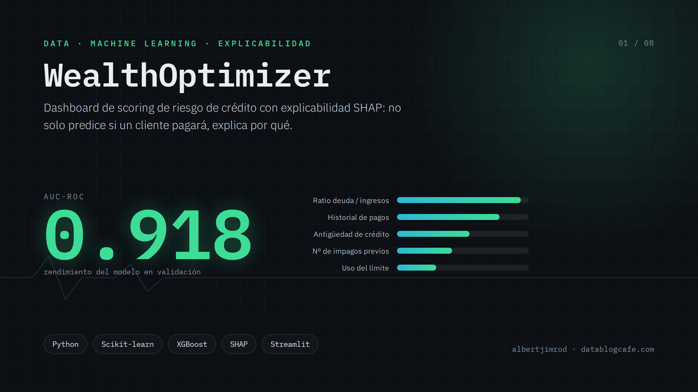
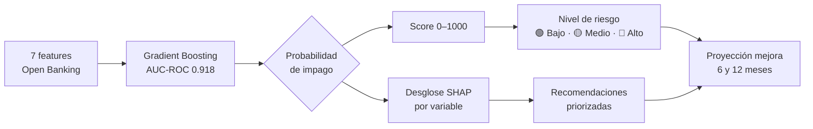
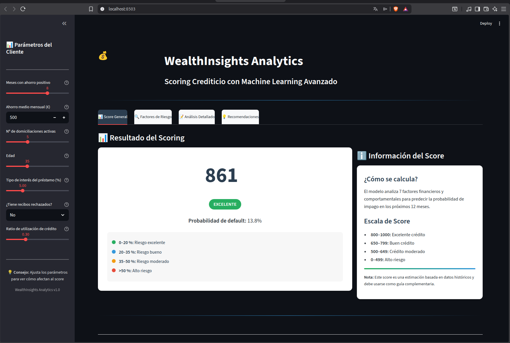
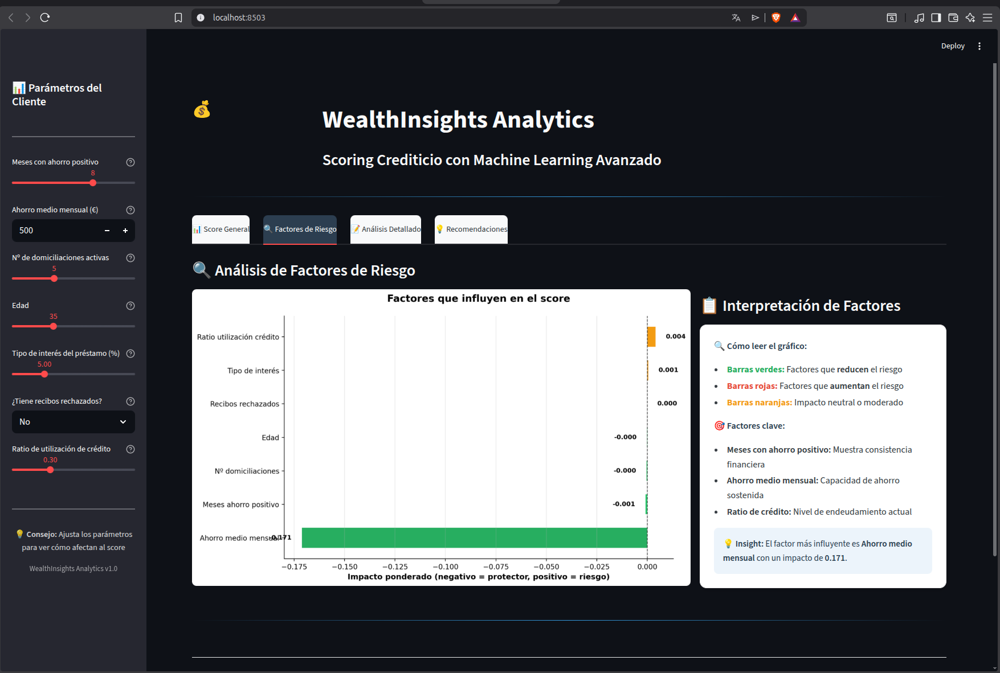
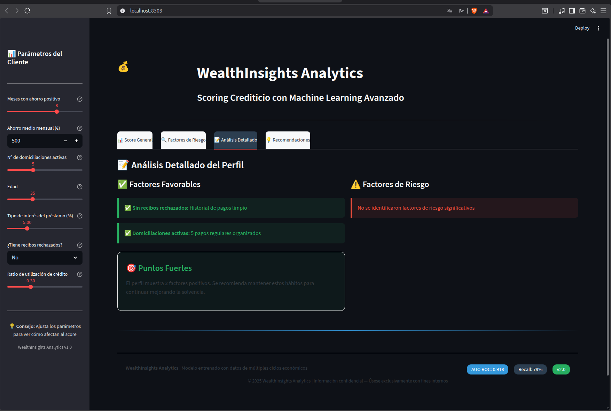
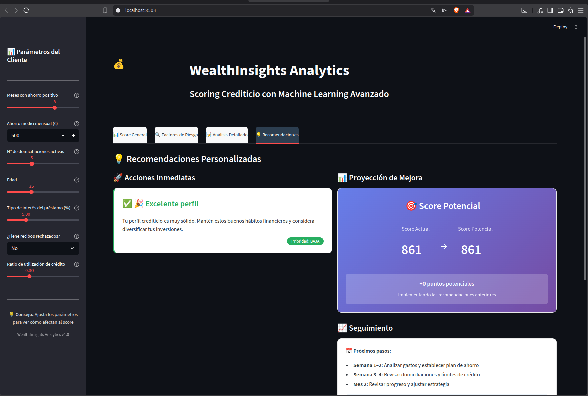

<div align="center">
  
</div>

---

<div align="center">
  
</div>

---

# WealthOptimizer — Credit Risk Scoring Dashboard

Dashboard interactivo de scoring de riesgo crediticio basado en datos bancarios abiertos (Open Banking). Predice la probabilidad de impago de un cliente y genera un score entre 0 y 1000, con explicabilidad mediante SHAP.

---

## Descripción

El sistema evalúa el perfil financiero de un cliente a partir de 7 variables derivadas de sus movimientos bancarios y genera:

- **Score crediticio** (0–1000): mayor score = menor riesgo
- **Probabilidad de impago** estimada por el modelo
- **Desglose SHAP** de las variables que más influyen en la predicción
- **Recomendaciones** para mejorar el perfil de riesgo
- **Proyección de mejora** del score a 6 y 12 meses

### Variables de entrada

| Variable | Descripción |
|----------|-------------|
| `meses_ahorro_positivo` | Meses de los últimos 12 con ahorro neto positivo |
| `ahorro_medio_mensual` | Ahorro medio mensual en euros |
| `n_domiciliaciones` | Número de domiciliaciones activas |
| `edad` | Edad del cliente |
| `tipo_interes` | Tipo de interés medio de sus deudas (%) |
| `tiene_recibos_rechazados` | Si ha tenido recibos devueltos en los últimos 6 meses |
| `ratio_utilizacion_credito` | Porcentaje de crédito disponible utilizado (0–1) |

---

## Flujo de análisis



---

## Modelo

- **Algoritmo:** Gradient Boosting Classifier (scikit-learn)
- **Entrenamiento:** 1.050.000 clientes sintéticos en 3 escenarios económicos (normal, crisis, expansión)
- **AUC-ROC:** 0.918
- **Recall:** 79%
- **Artefactos:** `dashboards/modelo_scoring_v2_1M.joblib`, `dashboards/features_v2_1M.joblib`

Ver `docs/scoring_funcionamiento.md` para documentación técnica completa.

---

## Estructura del proyecto

```
wealthoptimizer/
├── dashboards/
│   ├── dashboard_um_riesgo_v2.py      # Aplicación Streamlit principal
│   ├── modelo_scoring_v2_1M.joblib    # Modelo entrenado (1M instancias)
│   └── features_v2_1M.joblib          # Lista de features en orden correcto
└── docs/
    ├── scoring_funcionamiento.md      # Documentación técnica del scoring
    └── screenshots/                   # Capturas del dashboard
        ├── score_general.png
        ├── factores_riesgo.png
        ├── analisis_riesgo.png
        └── recomendaciones.png
```

---

## Requisitos

Python 3.11. Dependencias principales:

```
streamlit==1.52.2
pandas==2.3.3
numpy==2.3.5
scikit-learn==1.8.0
shap==0.50.0
plotly==6.5.0
joblib==1.5.3
matplotlib==3.10.8
```

### Instalación con conda

```bash
conda create -n wealthinsights python=3.11
conda activate wealthinsights
pip install streamlit pandas numpy scikit-learn shap plotly joblib matplotlib seaborn
```

O con el entorno completo desde el archivo de dependencias:

```bash
conda env create -f wealthinsights.yaml
conda activate wealthinsights
```

---

## Ejecución

```bash
conda activate wealthinsights
streamlit run dashboards/dashboard_um_riesgo_v2.py --server.port 8502
```

Abrir en el navegador: `http://localhost:8502`

---

## Capturas de pantalla

| Score General | Factores de Riesgo |
|:---:|:---:|
|  |  |

| Análisis Detallado | Recomendaciones |
|:---:|:---:|
|  |  |

---

## Pestañas del dashboard

1. **Score General** — Score 0–1000, nivel de riesgo y probabilidad de impago
2. **Factores de Riesgo** — Gráfico de impacto ponderado por variable (verde = protector, rojo = riesgo)
3. **Análisis Detallado** — Desglose de factores favorables y áreas de mejora del perfil
4. **Recomendaciones** — Acciones priorizadas y proyección de mejora del score

---

## Notas

- El modelo está entrenado sobre datos sintéticos estadísticamente calibrados; no contiene datos reales de clientes.
- Los artefactos `.joblib` incluidos corresponden al modelo v2 entrenado con 1.050.000 instancias.
- El dashboard no requiere conexión a ninguna API externa; funciona completamente en local.
